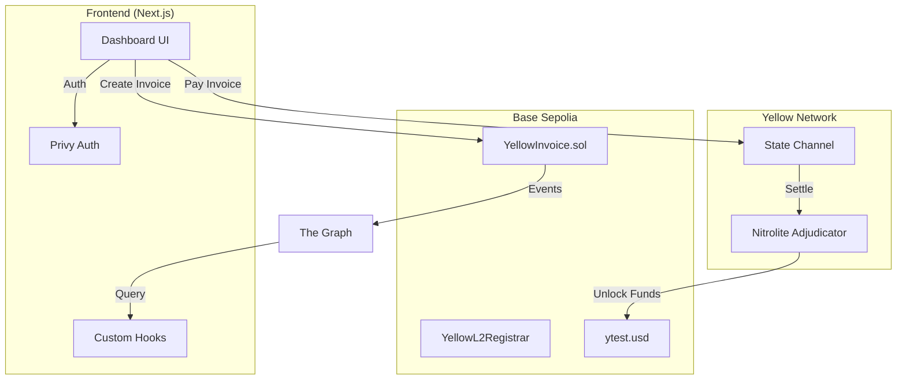

# Yellow Invoice

  

**Yellow Invoice** is a decentralized invoicing and payment platform that bridges traditional business workflows with high-speed Web3 settlement. It leverages **Yellow Network state channels** to enable instant, gas-free payments for invoices stored on-chain, providing a seamless experience for both merchants and clients.

---

## 📚 Table of Contents

- [System Architecture](#-system-architecture)
- [Key Features & Implementation](#-key-features--implementation)
- [Technical Stack](#-technical-stack)
- [Smart Contracts](#-smart-contracts)
- [Data Model](#-data-model)
- [Getting Started](#-getting-started)
- [Environment Configuration](#-environment-configuration)

---

## 🏗 System Architecture

The application is built on a hybrid **On-Chain / Off-Chain** architecture:

1.  **Registry Layer (On-Chain)**: Invoices are created and stored on **Base Sepolia**. This ensures an immutable record of the debt, terms, and line items.
2.  **Settlement Layer (Off-Chain)**: Payments are executed via **Yellow Network State Channels** (ERC-7824 Nitrolite). This allows for instant settlement without waiting for block confirmations or paying gas for every transaction.
3.  **Identity Layer (L2 ENS)**: Merchants identify themselves using `.yellow.eth` subnames (e.g., `alice.yellow.eth`), registered directly on L2 via the Durin protocol.
4.  **Indexing Layer**: The Graph indexes `InvoiceCreated` and `InvoiceSettled` events to power the dashboard's real-time statistics.



---

## 🌟 Key Features & Implementation

### 1. Instant Off-Chain Payments
Instead of simple ERC-20 transfers, we use **State Channels**.
- **How it works:** The payer opens a channel with the Yellow Network. They sign a state update transferring `ytest.usd` to the merchant. This update is final and instant.
- **Tech:** Uses `@erc7824/nitrolite` for the channel logic and `yellow-ts` for network communication.

### 2. On-Chain Invoice Registry
Invoices are full solidity structs, not just IPFS hashes.
- **Implementation:** The `YellowInvoice.sol` contract maps a `uint256` ID to an `Invoice` struct containing:
    - Merchant Address
    - Client Name
    - Amount & Terms
    - Line Items (serialized)
- **Status:** The `isPaid` boolean tracks settlement. It can only be toggled by the merchant (or a future oracle).

### 3. Identity & ENS-Based Payments
Merchants can register a `.yellow.eth` subname (e.g., `acme.yellow.eth`) on Base Sepolia.
- **Registration:** Handled by the `YellowL2Registrar` contract.
- **Resolution:** The app uses standard ENS resolution logic. When a payer types `acme.yellow.eth`, the system:
    1.  Resolves the name to the merchant's address using the L2 Resolver (Durin).
    2.  Initiates the state channel payment to that resolved address.
- **Benefit:** Payers never need to copy-paste error-prone 0x addresses; they just pay the business name.

### 4. Merchant Dashboard
A comprehensive view of business health.
- **Stats:** Total Revenue, Pending Invoices, Top Clients.
- **Charts:** Monthly Pay-in/Pay-out visualization using Recharts.
- **Data Source:** Fetched via GraphQL from our dedicated Subgraph.

### 5. Zero-Friction Onboarding
- **Privy Integration:** Users log in with Email or Google. An embedded wallet is automatically created for them.
- **No Extensions:** No MetaMask required (though supported).
- **Gas Abstraction:** (Planned) The app can sponsor gas for invoice creation.

---

## 🛠 Technical Stack

### Frontend
- **Framework**: [Next.js 16.1.6](https://nextjs.org/) (App Router)
- **Language**: TypeScript 5
- **Styling**: Tailwind CSS 4, Framer Motion
- **Components**: shadcn/ui (Radix UI primitives)
- **Icons**: Tabler Icons, Lucide React

### Web3 & State
- **Auth**: [Privy](https://privy.io/) (`@privy-io/react-auth`)
- **Ethereum**: Viem (`viem` ^2.45), Wagmi
- **State Channels**: `@erc7824/nitrolite`, `yellow-ts`
- **Data Fetching**: TanStack Query (`@tanstack/react-query` v5)

### Smart Contracts
- **Framework**: Foundry
- **Language**: Solidity ^0.8.20
- **Standard**: ERC-7824 (Nitrolite), ENS Durin

---

## 📜 Smart Contracts

### `YellowInvoice.sol`
**Address:** `0x4d04160633223533db789aab6610f54028295956` (Base Sepolia)

The core business logic.

```solidity
struct Invoice {
    address merchant;    // The issuer
    uint256 amount;      // Total due (6 decimals for USDC)
    bool isPaid;         // Settlement status
    string clientName;   // Payer identifier
    uint256 issuedDate;  // Timestamp
    uint256 dueDate;     // Timestamp
    string terms;        // Payment terms
    string services;     // Serialized JSON of line items
}
```

### `YellowL2Registrar.sol`
**Address:** `0x2F1f83A5802e24Cae6cb835406Fc71946231D97E` (Base Sepolia)

Manages L2 subnames. It interacts with the Durin L2 resolver to allow users to claim `name.yellow.eth` cheaply on Base Sepolia.

---

## 🚀 Getting Started

### Prerequisites
- Node.js v18+
- pnpm or npm
- Foundry (for contract work)

### Installation

1.  **Clone the repo**
    ```bash
    git clone https://github.com/your-org/yellow-invoice.git
    cd yellow-invoice
    ```

2.  **Install dependencies**
    ```bash
    cd frontend
    npm install
    ```

3.  **Run Development Server**
    ```bash
    npm run dev
    ```
    Access the app at `http://localhost:3000`.

---

## 🔐 Environment Configuration

Create a `.env.local` file in `frontend/` with the following:

| Variable | Description |
|---|---|
| `NEXT_PUBLIC_PRIVY_ID` | Your Privy App ID (from dashboard.privy.io) |
| `NEXT_PUBLIC_WALLET_CONNECT_PROJECT_ID` | WalletConnect Project ID for rainbowkit/wagmi |
| `NEXT_PUBLIC_RPC_URL` | (Optional) Custom RPC URL for Base Sepolia |

For contracts, create `.env` in `contracts/`:

| Variable | Description |
|---|---|
| `PRIVATE_KEY` | Deployer wallet private key |
| `RPC_URL` | Base Sepolia RPC endpoint |
| `ETHERSCAN_API_KEY` | For contract verification |
| `L2_REGISTRY_ADDRESS` | Address of the L2 Registry for Durin |

---

## 🧪 Testing Strategy

- **Contracts**: `forge test` runs the Solidity test suite, covering invoice creation, edge cases (double payment), and access control.
- **Frontend**: Currently relies on manual QA. E2E tests with Cypress are on the roadmap.

---

## 🤝 Contributing

We welcome contributions! Please follow the standard fork-and-pull-request workflow.

1.  Fork the project.
2.  Create your feature branch (`git checkout -b feature/AmazingFeature`).
3.  Commit your changes.
4.  Push to the branch.
5.  Open a Pull Request.

---

*Built with 💛 by the Yellow Invoice Team.*
